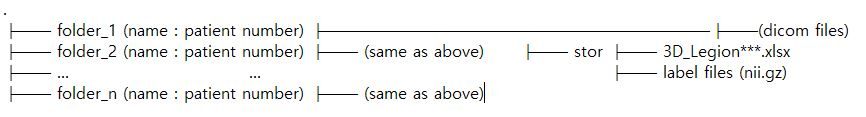
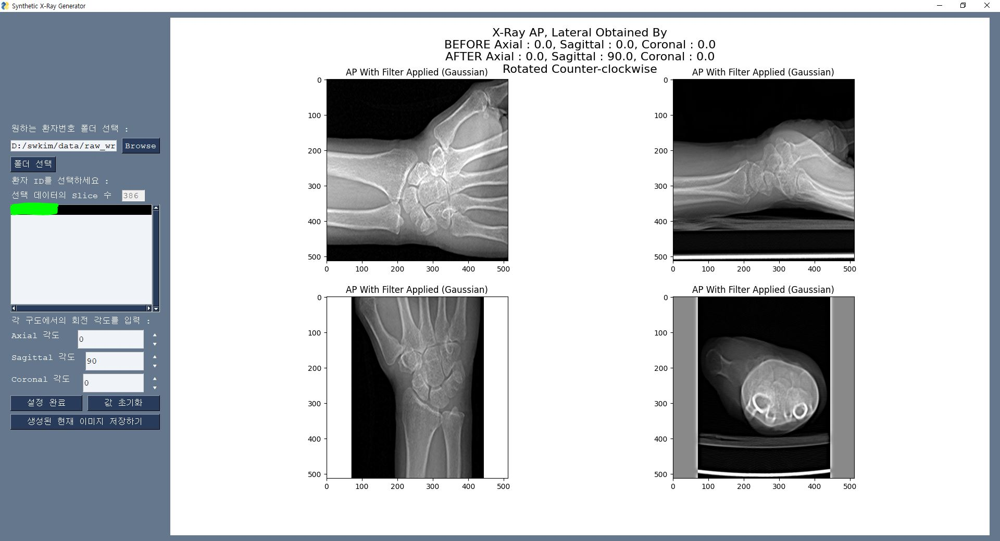
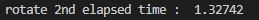

# Synthetic X-Ray Image Generator (Digitally Reconstructed Radiograph Generator) supported in Korean

**UPDATED!!**
(2.13.2023) 

+ Removed requirements for the input directory formats; automatically scans DICOM files if parent folder is selected.

+ beta functionality to display AP X-Ray Label generated as nii.gz files by other softwares.

+ Users can now crop images when the generated x-rays have white or black corners unrelated to the actual image.

## Abstract
This is a simple DRR generator programmed by PySimpleGUI. The main idea of this program to generate a satisfying quality of DRR is to :
1) Stack DICOM images (512 x 512) by the z-axis and acquire a 3d image.
2) Build an approximate projection of the 3d image by using np.mean w.r.t a specific axis.
3) Apply Gaussian Filter to emphasize the edges of the projection.
4) Rotate the 3d image acquired in stage 2) and capture the best angle of the rotation.
This program was developed to generate DRR for training a deep learning network which can handle semantic segmentation tasks.

## Requirements
Requirements are included in the text file requirements.txt. You can download the required libraries by running
`pip install -r requirements.txt`

## Description of the Rotation Methods
This program refered to the post https://stackoverflow.com/questions/56171643/simpleitk-rotation-of-volumetric-data-e-g-mri. 
It derives a Rodrigues rotation matrix from the rotation axis and the rotation angle and applies the transformation matrix to 
the original simpleITK image series (volume).
Former method was using the scipy.ndimage.rotate(). However, the rotation took considerable time to finish. Hence, it is not recommended that
you use this method.

## Purpose
This program shows AP and Lateral X-ray view, but they do not always show the right view for each perspectives. Users must focus on only one of
those views and create AP and Lateral viewed x-ray for themselves. (In my case, I had to compare rotated images with the segmentation masks)

## Prerequisites
The directories including the patient's DICOM files and labels must have the following hierarchy.

                   

**The code of the part handling label files is obsolete for the usage of this program, so you may remove that part and run the program for convenience.**

## Actual Performance (Images)
The patient number and other sensitive informations of the patient have been annonymized.

Below is the image of the program executed **(Rotation by axial : 0 degrees, sagittal : 90 degrees, coronal : 0 degrees)** 

Other combinations of rotation is also possible.

Fast rotation method took 1.3742 seconds in RTX 3070 + Intel Core i7 3.8GHz Octa-Core System.

